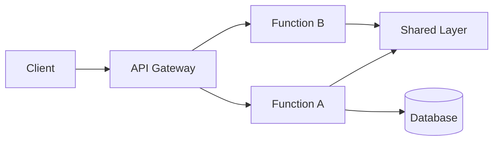

# Jo Yuri — Back-end (Lambdas)

AWS Lambda functions that power the Jo Yuri fan-site API — serving content resources (discography, gallery, schedule, carousel, and links), ingesting news articles and YouTube videos on a daily schedule, and processing uploaded images through an automated resize-and-convert pipeline.

| Component | Repository | Description |
|---|---|---|
| 📘 Docs (hub) | [TODO: docs-repo-name](TODO: link) | Architecture, OpenAPI specification, and cross-repo decisions |
| 🎨 Front-end | [TODO: frontend-repo-name](TODO: link) | Next.js application that renders the public site |
| ⚙️ Back-end (this repo) | [TODO: this-repo-name](TODO: link) | AWS Lambda functions that implement the REST API |

## Tech stack

| Item | Value |
|---|---|
| Runtime | Python 3.14 (uniform across all functions, arm64 architecture) |
| IaC / Framework | AWS SAM — one `template.yaml` per function under `/functions/<name>/` |
| Provider | AWS (Lambda, API Gateway, DynamoDB, S3, EventBridge) |
| Package manager | pip (dependencies pre-packaged at the layer level in `/layers/`; no `requirements.txt` in individual functions) |
| API documentation | OpenAPI spec hosted externally on CDN (`cdn.zo.glass`), served via a dedicated Swagger UI function (`jo-yuri-docs`) — **not** versioned in this repo |
| Tests | No automated tests |

## Architecture (summary)

Amazon API Gateway routes incoming REST requests to serverless Lambda functions (such as `jo-yuri-api` and `jo-yuri-upload-presign`), secured by a custom Lambda Authorizer (`jo-yuri-api-key`). Content persistence and querying are handled via Amazon DynamoDB using data access models from the shared `zo-glass` Lambda layer. Scheduled EventBridge rules trigger daily background functions (`jo-yuri-news` and `jo-yuri-youtube`) to ingest external news and YouTube content into DynamoDB. Media uploads to S3 asynchronously trigger `jo-yuri-process-image` to resize and convert uploaded images into WebP format for CDN delivery.



## Lambda functions

| Function | Role | Trigger | Summary | Docs |
|---|---|---|---|---|
| jo-yuri-api | Business | HttpApi — multiple routes (see README) | CRUD API for content resources (carousel, discography, gallery, news, schedule, video) with Cognito-based admin authorization | [→ README](./functions/jo-yuri-api/README.md) |
| jo-yuri-api-key | Authorizer | Lambda Authorizer (invoked by API Gateway; template has placeholder HttpApi triggers) | Validates requests by comparing the `key` query parameter against an API key stored in SSM Parameter Store | [→ README](./functions/jo-yuri-api-key/README.md) |
| jo-yuri-docs | Docs/Infra | HttpApi `ANY /docs` | Serves an HTML page with embedded Swagger UI loading the OpenAPI spec from `cdn.zo.glass` | [→ README](./functions/jo-yuri-docs/README.md) |
| jo-yuri-news | Business | Schedule `cron(0 0 * * ? *)` (daily, midnight UTC) | Scrapes Google News RSS for Jo Yuri articles, decodes redirect URLs, and persists new items to DynamoDB | [→ README](./functions/jo-yuri-news/README.md) |
| jo-yuri-process-image | Business | S3 event (trigger configured externally, not in template.yaml) | Downloads uploaded images from S3, crops and resizes per resource type, converts to WebP, and updates DynamoDB status | [→ README](./functions/jo-yuri-process-image/README.md) |
| jo-yuri-upload-presign | Business | HttpApi `ANY /admin/upload/presign` | Generates presigned S3 POST URLs for admin image uploads (gallery, carousel, discography) | [→ README](./functions/jo-yuri-upload-presign/README.md) |
| jo-yuri-youtube | Business | Schedule `cron(0 0 * * ? *)` (daily, midnight UTC) | Fetches latest videos from Jo Yuri's YouTube channel via Data API v3 and persists new entries to DynamoDB | [→ README](./functions/jo-yuri-youtube/README.md) |

## Layers

| Layer | Type | Summary | Used by | Docs |
|---|---|---|---|---|
| Python-googlenewsdecoder | Packaged dependency | `googlenewsdecoder` library for resolving Google News redirect URLs | jo-yuri-news | [→ README](./layers/Python-googlenewsdecoder/README.md) |
| Python-pillow | Packaged dependency | Pillow (PIL) library for image resizing, cropping, and format conversion | jo-yuri-process-image | [→ README](./layers/Python-pillow/README.md) |
| Python-requests-bs4 | Packaged dependency | `requests` (HTTP client) and `beautifulsoup4` (HTML parsing) libraries | jo-yuri-news, jo-yuri-youtube | [→ README](./layers/Python-requests-bs4/README.md) |
| zo-glass | Own | Shared DynamoDB client, API response helpers, and domain model classes (Carousel, Discography, Gallery, News, Schedule, Video) | jo-yuri-api, jo-yuri-news, jo-yuri-youtube | [→ README](./layers/zo-glass/README.md) |

## Prerequisites

- Python 3.14
- AWS CLI v2 (configured with credentials for the target account)
- AWS SAM CLI (`sam`)

## Local setup

```bash
git clone <repo-url>
cd jo-yuri-lambda
# Dependencies are pre-packaged in /layers — no install step required for functions
```

## Running locally

```bash
# Each function has its own template.yaml — invoke from the function's directory:
cd functions/<function-name>
sam build
sam local invoke
```

## Tests

No automated tests are currently configured.

## Deployment

[TODO]

## Folder structure

```
.
├── functions/
│   ├── jo-yuri-api/          # Main REST API (multiple routes)
│   ├── jo-yuri-api-key/      # Lambda Authorizer
│   ├── jo-yuri-docs/         # Swagger UI page
│   ├── jo-yuri-news/         # Scheduled news scraper
│   ├── jo-yuri-process-image/# S3-triggered image processor
│   ├── jo-yuri-upload-presign/# Presigned upload URL generator
│   └── jo-yuri-youtube/      # Scheduled YouTube ingestion
├── layers/
│   ├── Python-googlenewsdecoder/  # Packaged dependency
│   ├── Python-pillow/             # Packaged dependency
│   ├── Python-requests-bs4/       # Packaged dependency
│   └── zo-glass/                  # Own: shared utilities & models
└── README.md
```

## Environment variables / Secrets (global)

| Variable | Description | Where it's defined |
|---|---|---|
| `jo-yuri-api-key` | API key for authorizing requests | SSM Parameter Store |
| `jo-yuri-youtube-api-key` | YouTube Data API key | SSM Parameter Store |

## Repository conventions

[TODO]

## Contributing

This is a personal/private project and is not open to external contributions at this time.

## License

This project is licensed under the GNU General Public License v3.0 (GPLv3).
